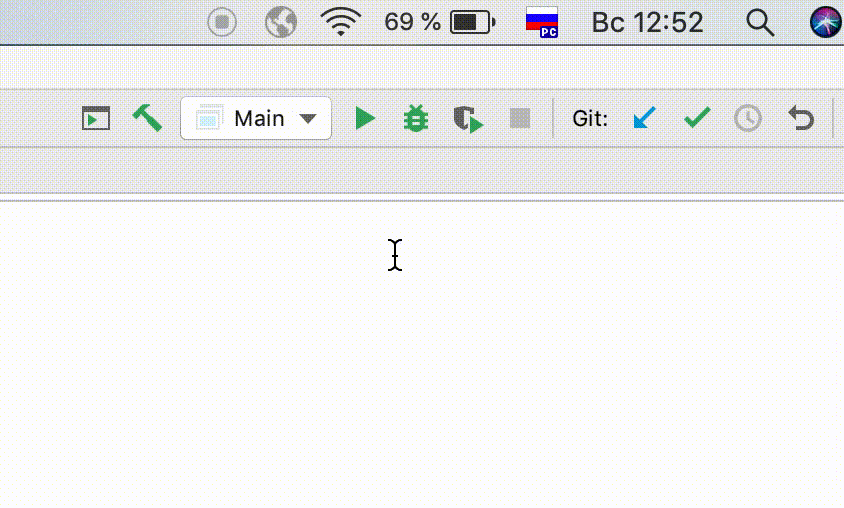

# Patriot

Patriotic program switching ru lang to ua

## Getting Started

These instructions will get you a copy of the project up and running on your local machine for development and 
testing purposes. 
See deployment for notes on how to deploy the project on a live system.

### Prerequisites

* [JDK](https://www.oracle.com/technetwork/java/javase/downloads/jdk8-downloads-2133151.html) **1.8+**
* [SikuliX API](https://launchpad.net/sikuli/sikulix) **v.1.1.2**
* Replaced images of ru flag and ua flag depending on your OS (for OSX it's not required)

